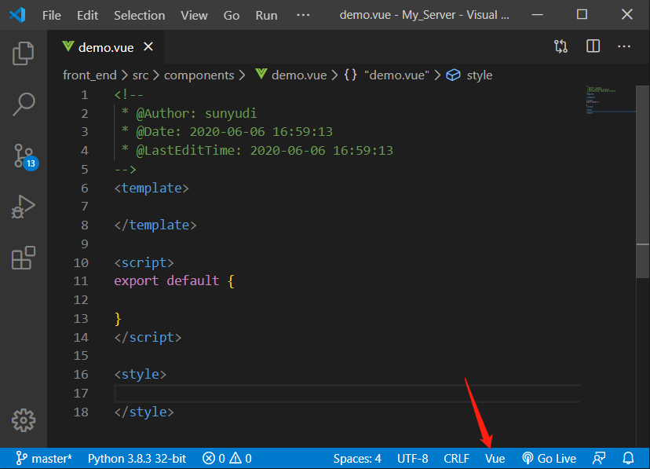
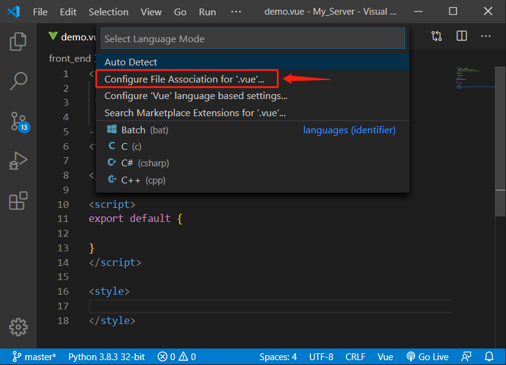
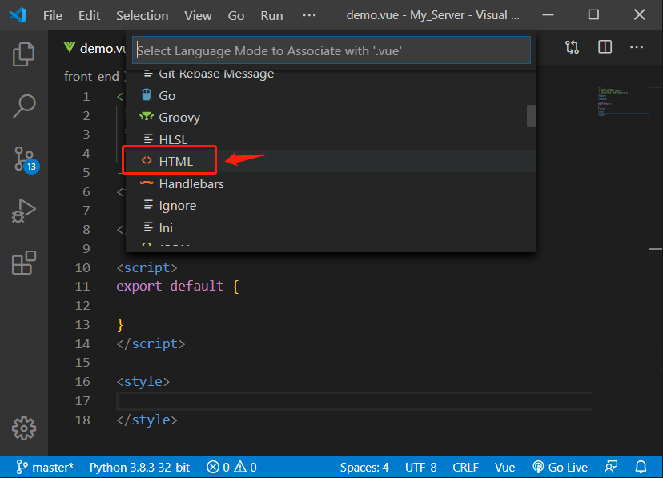

<!--
 * @Author: sunyudi
 * @Date: 2020-06-06 11:37:13
 * @LastEditTime: 2020-10-17 15:18:04
--> 
# Tell you some notes about Vue

## CSS Lint of .vue in VSCode

1. Open a `.vue` file in VSCode

2. Click the `Vue` button on right-bottom corner

    

3. Select the marked option

    

4. Choose `HTML`

    

5. Done!

## Vue Directive

1. v-bind

    <template>
        
    </template>

    

2. v-if

    <template>
         Now you can see me 
    </template>

    

3. v-for

    <template>
        <li v-for="todo in todos">
            {{ todo.text }}
        </li>
    </template>

    

4. v-on

    <template>
        
{{ message }}

        <button v-on:click="reverseMessage">Reverse Message</button>
    </template>

    

5. v-model (two-way binding)

    <template>
        
{{ message }}

        <input v-model="message">
    </template>

    

## Cross-site Problem

When making a http request in vue, you may meet cross-site problem. So the connection will be blocked by CORS policy.

    this.$http.get('/api/sample')
        .then(response => {

        })
        .catch(error => {

        });

The reason is "The front end and back end are in different networks, although you start them on one computer."

To solve this problem, just create "vue.config.js" file and add the following code

    module.exports = {
        devServer: {
            proxy: 'http://127.0.0.1:5000'  // your back_end server
        },
    }